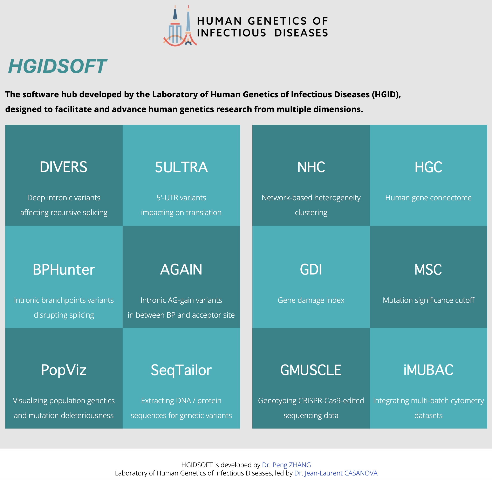

# HGIDSOFT
The software hub developed by the Laboratory of Human Genetics of Infectious Diseases (HGID), designed to facilitate and advance human genetics research across multiple domains.

HGIDSOFT provides a collection of bioinformatics tools to improve the detection, interpretation, and visualization of genetic variation in human disease.

## Announcement
- We are currently moving from The Rockefeller University in New York, to UT Southwestern in Dallas. 
- The current HGIDSOFT webserver at https://hgidsoft.rockefeller.edu/ will be offline during our institutional transition.
- Our new HGIDSOFT webserver will be rebuilt in UTSW, and its website will be released once available, ~ mid-July 2026.

## Software List
- 5ULTRA: 5'-UTR variants that impacting on translation
- DIVERS: Deep intronic variants that affecting recursive splicing
- AGAIN: Intronic AG-gain variants in between BP and acceptor site
- BPHunter: Intronic branchpoints variants that disrupting splicing
- NHC: Network-based heterogeneity clustering
- SeqTailor: Extracting DNA / protein sequences for genetic variants
- PopViz: Visualizing population genetics and mutation deleteriousness
- HGC: Human gene connectome
- GDI: Gene damage index
- MSC: Mutation significance cutoff
- GMUSCLE: Genotyping CRISPR-Cas9-edited sequencing data
- iMUBAC: Integrating multi-batch cytometry datasets

## Contact
> Peng Zhang, PhD (pzhang@rockefeller.edu; Peng.Zhang@UTSouthwestern.edu)

> Jean-Laurent Casanova, MD, PhD (casanova@rockefeller.edu; Jean-Laurent.Casanova@UTSouthwestern.edu)

